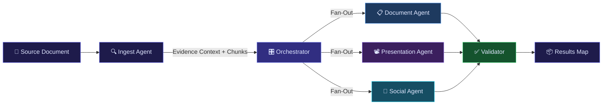

<p align="center">
  
  
  
</p>

<h1 align="center">
  🧠 CortexAI
</h1>

<h3 align="center">
  <em>AI-Powered Crisis Communications & Disaster Response Engine</em>
</h3>

<p align="center">
  <strong>Smart India Hackathon 2024 — Problem Statement #154</strong><br/>
  <sub>Multi-Agent RAG Platform for Automated Disaster Communication Generation</sub>
</p>

<p align="center">
  
  
  
  
  
  
  
  
</p>

---

## 🎯 Problem Statement

> **PS-154:** *"Development of AI/ML-based solution for generating disaster-related communications in varied textual, visual, and multimedia formats from situational reports."*

During a disaster, **every minute counts**. Emergency agencies receive dense situational reports but must rapidly produce communications across **7+ different formats** — advisories, executive summaries, video scripts, presentations, social media posts — each tailored to a different audience, tone, and language.

**CortexAI solves this** by ingesting a single source document and generating **all formats in parallel** using a multi-agent LangGraph pipeline, with every claim grounded and cited against the original source evidence.

---

## ✨ Key Features

<table>
<tr>
<td width="50%">

### 🔄 Multi-Format Parallel Generation
Upload one disaster report → receive **7 outputs simultaneously**:
- 📋 **Advisory** — Formal situation advisory with grounded claims
- 📊 **Executive Summary** — Key facts, decisions, and action items
- 🎬 **Video Script** — Scene-by-scene production-ready script
- 📽️ **Presentation (PPTX)** — Downloadable slide deck with speaker notes
- 📈 **Infographic** — Data visualization layout with statistics
- 💼 **LinkedIn Post** — Professional engagement post
- 🐦 **X/Twitter Post** — Platform-optimized thread or post

</td>
<td width="50%">

### 🛡️ Evidence Grounding & Citations
Every generated output is **anchored to source chunks** from the uploaded document:
- 🔗 Citation resolution with chunk-level anchors
- ✅ Automated validation (completeness, safety, PII, platform rules)
- 🔍 Transparent source traceability per output
- 📎 One shared evidence pass across all agents

</td>
</tr>
<tr>
<td width="50%">

### 🎛️ Granular Generation Controls
Fine-tune every output from the dashboard:
- 🎯 **Target Audience** — Public, Policymakers, Responders, Media, Internal
- 🎙️ **Communication Tone** — Urgent, Formal, Clear, Reassuring, Analytical
- 🌐 **Output Language** — English, Hindi, Spanish, French, German, Regional
- 📏 **Detail Level** — Brief, Standard, Detailed
- 🎯 **Mission Objective** — Free-text custom directive

</td>
<td width="50%">

### ⚡ Production-Ready Features
- 🔐 Google OAuth + Guest/Demo mode authentication
- 🎙️ Voice dictation input (Web Speech API)
- 📁 Drag & drop file upload (PDF, DOCX, TXT, HTML, Images)
- ✏️ Inline editing of generated outputs
- 👍 Approve / Regenerate workflow per format
- 📥 JSON export + binary download (PPTX, PDF)
- 💬 Conversation history with persistent sessions
- 📱 Fully responsive mobile-first design

</td>
</tr>
</table>

---

## 🏗️ System Architecture

```
┌─────────────────────────────────────────────────────────────────────┐
│                         CLIENT (React 19 + Vite)                   │
│  ┌──────────┐  ┌──────────┐  ┌───────────┐  ┌──────────────────┐  │
│  │ SideBar  │  │ ChatArea │  │ ChatInput │  │   ResultsGrid    │  │
│  │ Sessions │  │ Messages │  │ Controls  │  │ ResultCard × N   │  │
│  └──────────┘  └──────────┘  └───────────┘  └──────────────────┘  │
│              Redux Toolkit (user / conversation / message)         │
└──────────────────────────────┬──────────────────────────────────────┘
                               │ HTTPS / FormData
                               ▼
┌──────────────────────────────────────────────────────────────────────┐
│                      API GATEWAY (:8000)                            │
│  Express + JWT Auth Middleware + Reverse Proxy                      │
│  ┌──────────────┐  ┌─────────────┐  ┌──────────────┐               │
│  │ /api/auth/*  │  │ /api/chat/* │  │ /api/agent/* │               │
│  │  → :8001     │  │  → :8002    │  │   → :8003    │               │
│  └──────────────┘  └─────────────┘  └──────────────┘               │
└──────────────────────────────────────────────────────────────────────┘
         │                    │                    │
         ▼                    ▼                    ▼
  ┌─────────────┐     ┌─────────────┐     ┌───────────────────────────┐
  │ Auth Service│     │ Chat Service│     │     Agent Service          │
  │   (:8001)   │     │   (:8002)   │     │       (:8003)             │
  │             │     │             │     │                           │
  │ Firebase    │     │ Conversations│    │  ┌─────────────────────┐  │
  │ Admin SDK   │     │ + Messages  │     │  │   LangGraph State   │  │
  │ → MongoDB   │     │ → MongoDB   │     │  │   Machine (DAG)     │  │
  └─────────────┘     └─────────────┘     │  └──────┬──────────────┘  │
                                          │         │                 │
                                          │         ▼                 │
                                          │  ┌─────────────┐         │
                                          │  │  Ingest      │         │
                                          │  │  Agent       │         │
                                          │  │ (RAG: parse  │         │
                                          │  │  + embed +   │         │
                                          │  │  chunk)      │         │
                                          │  └──────┬───────┘         │
                                          │         │                 │
                                          │         ▼                 │
                                          │  ┌─────────────────────┐  │
                                          │  │   Orchestrator      │  │
                                          │  │ (Promise.allSettled)│  │
                                          │  └──┬───┬───┬───┬──┘     │
                                          │     │   │   │   │        │
                                          │     ▼   ▼   ▼   ▼        │
                                          │  ┌───┐┌───┐┌───┐┌───┐   │
                                          │  │Doc││Prs││Soc││Val│   │
                                          │  │Agt││Agt││Agt││ id│   │
                                          │  └───┘└───┘└───┘└───┘   │
                                          │                          │
                                          │  → MongoDB │ → S3/Cloud  │
                                          └───────────────────────────┘

┌──────────────────────────────────────────────────────────────────────┐
│                    Infrastructure (Docker Compose)                   │
│              MongoDB (cortexai-mongodb) + Redis (cortexai-redis)     │
└──────────────────────────────────────────────────────────────────────┘
```

---

## 🤖 Multi-Agent Pipeline (LangGraph)

CortexAI's core is a **LangGraph state machine** that orchestrates specialized AI agents:



| Agent | Role | Output Types |
|-------|------|-------------|
| **Ingest Agent** | Parses documents (PDF/DOCX/TXT/HTML/Image), creates embeddings, chunks content, and builds the shared evidence context | Evidence context + source chunks |
| **Document Agent** | Generates text-based communications grounded in evidence | Advisory, Executive Summary, Video Script |
| **Presentation Agent** | Creates structured slide decks and data visualizations | Presentation (PPTX), Infographic |
| **Social Agent** | Crafts platform-optimized social media content | LinkedIn Post, X/Twitter Post |
| **Validator** | Runs completeness, grounding, safety/PII, and platform constraint checks | Validation report per output |

---

## 📂 Project Structure

```
cortexAI/
├── frontend/                     # React 19 + Vite + TailwindCSS 4
│   ├── src/
│   │   ├── components/
│   │   │   ├── ChatArea.jsx      # Main chat container
│   │   │   ├── ChatInput.jsx     # Generation controls + file upload + voice
│   │   │   ├── MessageList.jsx   # Message thread with auto-scroll
│   │   │   ├── MessageBubble.jsx # Markdown renderer + code highlighting
│   │   │   ├── ResultsGrid.jsx   # Multi-output grid layout
│   │   │   ├── ResultCard.jsx    # Per-format card (edit/approve/export)
│   │   │   ├── LoadingAnimation.jsx  # Animated processing indicator
│   │   │   ├── Nav.jsx           # Session header bar
│   │   │   └── SideBar.jsx       # Collapsible session navigator
│   │   ├── features/             # API integration layer
│   │   ├── redux/                # State management (RTK)
│   │   ├── pages/
│   │   │   └── Home.jsx          # Login + main layout
│   │   ├── App.jsx               # Root component
│   │   └── main.jsx              # Entry point
│   └── utils/                    # Axios + Firebase config
│
├── backend/
│   ├── gateway/                  # API Gateway (:8000)
│   │   ├── controllers/          # User controller
│   │   ├── middleware/            # JWT auth middleware
│   │   └── utils/                # Proxy with header injection
│   │
│   ├── services/
│   │   ├── auth/                 # Auth Service (:8001)
│   │   │   ├── controllers/      # Firebase token verification
│   │   │   ├── models/           # User model
│   │   │   └── routes/           # Auth routes
│   │   │
│   │   ├── chat/                 # Chat Service (:8002)
│   │   │   ├── controllers/      # Conversation CRUD
│   │   │   ├── models/           # Message + Conversation models
│   │   │   └── routes/           # Chat routes
│   │   │
│   │   └── agent/                # Agent Service (:8003) ⭐ Core
│   │       ├── agents/           # Specialized AI agents
│   │       │   ├── ingest.agent.js       # RAG: parse, embed, chunk
│   │       │   ├── document.agent.js     # Advisory, Summary, Script
│   │       │   ├── presentation.agent.js # PPTX + Infographic
│   │       │   └── social.agent.js       # LinkedIn + Twitter
│   │       ├── graph/            # LangGraph state machine
│   │       │   ├── graph.js      # DAG definition
│   │       │   ├── state.js      # Agent state schema
│   │       │   ├── orchestrator.js # Parallel fan-out
│   │       │   └── validate.js   # Output validation
│   │       ├── config/           # DB, LLM, S3, Vector DB configs
│   │       ├── models/           # Job model
│   │       └── utils/            # PDF/PPTX gen, S3 upload
│   │
│   ├── shared/                   # Shared Redis config
│   └── docker-compose.yml        # MongoDB + Redis
│
├── .github/workflows/            # CI/CD deployment pipeline
└── .gitignore
```

---

## 🚀 Quick Start

### Prerequisites

| Tool | Version | Purpose |
|------|---------|---------|
| **Node.js** | ≥ 18.x | Runtime |
| **Docker** | Latest | MongoDB + Redis |
| **Groq / Gemini API Key** | — | LLM inference |
| **Firebase Project** | — | OAuth (optional — guest mode works without it) |

### 1️⃣ Clone & Install

```bash
git clone https://github.com/Kaushik1609/SIH_PS-154-.git
cd SIH_PS-154-/1.cortexAI
```

### 2️⃣ Start Infrastructure

```bash
cd backend
docker compose up -d          # Starts MongoDB + Redis
```

### 3️⃣ Configure Environment Variables

**Gateway** (`backend/gateway/.env`):
```env
PORT=8000
FRONTEND_URL=http://localhost:5173
AUTH_SERVICE=http://localhost:8001
CHAT_SERVICE=http://localhost:8002
AGENT_SERVICE=http://localhost:8003
JWT_SECRET=your_jwt_secret
```

**Auth Service** (`backend/services/auth/.env`):
```env
PORT=8001
MONGO_URI=mongodb://localhost:27017/cortexai-auth
```

**Chat Service** (`backend/services/chat/.env`):
```env
PORT=8002
MONGO_URI=mongodb://localhost:27017/cortexai-chat
```

**Agent Service** (`backend/services/agent/.env`):
```env
PORT=8003
MONGO_URI=mongodb://localhost:27017/cortexai-agent
GROQ_API_KEY=your_groq_api_key
GEMINI_API_KEY=your_gemini_api_key
AWS_ACCESS_KEY_ID=your_aws_key          # Optional: for S3 artifact storage
AWS_SECRET_ACCESS_KEY=your_aws_secret   # Optional
AWS_REGION=ap-south-1                   # Optional
S3_BUCKET=cortexai-artifacts            # Optional
```

**Frontend** (`frontend/.env`):
```env
VITE_API_URL=http://localhost:8000
```

### 4️⃣ Start All Services

Open **4 terminals** and run:

```bash
# Terminal 1 — Gateway
cd backend/gateway && npm install && npm start

# Terminal 2 — Auth Service
cd backend/services/auth && npm install && npm start

# Terminal 3 — Chat Service
cd backend/services/chat && npm install && npm start

# Terminal 4 — Agent Service
cd backend/services/agent && npm install && npm start
```

### 5️⃣ Start Frontend

```bash
cd frontend
npm install
npm run dev
```

🎉 **Open** [http://localhost:5173](http://localhost:5173) — click **"Continue as Guest"** to start immediately!

---

## 🎬 How It Works

```
                    ╔══════════════════════════════════════╗
                    ║   User uploads disaster report (PDF) ║
                    ║   + selects 7 output formats         ║
                    ║   + sets audience: "General Public"   ║
                    ║   + sets tone: "Urgent & Authoritative"║
                    ╚══════════════════╤═══════════════════╝
                                       │
                    ┌──────────────────▼──────────────────┐
                    │     🔍 Ingest Agent                  │
                    │  Parse PDF → Split into chunks →     │
                    │  Generate embeddings → Build         │
                    │  evidence context with anchors       │
                    └──────────────────┬──────────────────┘
                                       │
                    ┌──────────────────▼──────────────────┐
                    │     🎛️ Orchestrator                  │
                    │  Promise.allSettled fan-out to all   │
                    │  7 agents running in parallel        │
                    └──┬────┬────┬────┬────┬────┬────┬──┘
                       │    │    │    │    │    │    │
                       ▼    ▼    ▼    ▼    ▼    ▼    ▼
                    ┌────┐┌────┐┌────┐┌────┐┌────┐┌────┐┌────┐
                    │Adv ││Summ││VidS││PPTX││Info││Link││Twit│
                    └──┬─┘└──┬─┘└──┬─┘└──┬─┘└──┬─┘└──┬─┘└──┬─┘
                       │     │     │     │     │     │     │
                    ┌──▼─────▼─────▼─────▼─────▼─────▼─────▼──┐
                    │     ✅ Validator (per-output)             │
                    │  Completeness · Grounding · Safety/PII   │
                    │  Platform constraints · Citation check    │
                    └──────────────────┬───────────────────────┘
                                       │
                    ┌──────────────────▼──────────────────┐
                    │     📦 Results Dashboard             │
                    │  Edit inline · Approve · Regenerate  │
                    │  Export JSON · Download PPTX/PDF      │
                    └──────────────────────────────────────┘
```

---

## 🛠️ Tech Stack Deep Dive

| Layer | Technology | Why |
|-------|-----------|-----|
| **Frontend** | React 19, Vite 8, TailwindCSS 4 | Blazing fast HMR, modern RSC-ready React, utility-first CSS |
| **State** | Redux Toolkit | Predictable state for conversations, messages, and user session |
| **UI Motion** | Framer Motion (`motion`) | Smooth loading animations and micro-interactions |
| **Markdown** | react-markdown + remark-gfm + Prism | Rich AI response rendering with tables, code blocks, GFM |
| **Auth** | Firebase Auth + Google OAuth | One-tap sign-in with token-based gateway auth |
| **Gateway** | Express + express-http-proxy | Unified API surface with JWT middleware and request forwarding |
| **AI Core** | LangGraph (LangChain) | Stateful DAG-based multi-agent orchestration |
| **LLMs** | Groq (Llama 3) / Google Gemini | Fast inference with configurable model selection |
| **Vector DB** | Configurable embeddings pipeline | Document chunking and semantic retrieval for RAG |
| **Database** | MongoDB | Document store for users, conversations, messages, jobs |
| **Cache** | Redis | Session caching and rate limiting |
| **Storage** | AWS S3 (optional) | Binary artifact storage (PPTX, PDF exports) |
| **DevOps** | Docker Compose, GitHub Actions | One-command infra + automated CI/CD |

---

## 🔑 API Endpoints

| Method | Endpoint | Service | Description |
|--------|----------|---------|-------------|
| `POST` | `/api/auth/login` | Auth | Firebase token verification + JWT issue |
| `GET` | `/api/me` | Gateway | Get current authenticated user |
| `GET` | `/api/chat/conversations` | Chat | List user conversations |
| `POST` | `/api/chat/conversations` | Chat | Create new conversation |
| `PUT` | `/api/chat/conversations/:id` | Chat | Update conversation title |
| `GET` | `/api/chat/messages/:conversationId` | Chat | Get messages for a conversation |
| `POST` | `/api/agent/generate` | Agent | **Core** — Multipart upload + multi-format generation |
| `GET` | `/api/agent/jobs` | Agent | Get user's generation job history |

---

## 🏆 What Makes This Hackathon-Worthy

| Differentiator | Description |
|---------------|-------------|
| **🧠 Multi-Agent Architecture** | Not a simple chatbot — a LangGraph DAG with specialized agents, fan-out orchestration, and independent validation |
| **📎 Evidence Grounding** | Every generated claim is anchored to source document chunks with citation resolution — no hallucinations |
| **⚡ 7 Formats in Parallel** | One upload, one click, seven simultaneous outputs via `Promise.allSettled` |
| **🎛️ Granular Controls** | Audience, tone, language, detail level, and custom objectives — not a black box |
| **✅ Built-in Validation** | Automated checks for completeness, grounding accuracy, PII/safety, and platform-specific constraints |
| **📱 Production UI** | Responsive dark-mode interface with voice input, drag-drop, inline editing, approve/regenerate workflow |
| **🔌 Microservices** | Gateway + 3 independently deployable services + Docker Compose — horizontally scalable |
| **🔐 Auth Flexibility** | Full Google OAuth + instant Guest mode for demo scenarios |

---

## 👥 Team

Built with ❤️ for **Smart India Hackathon 2024**

---

## 📄 License

This project is built for the **Smart India Hackathon 2024** competition under Problem Statement #154. All rights reserved by the team.

---

<p align="center">
  
  
  
</p>
